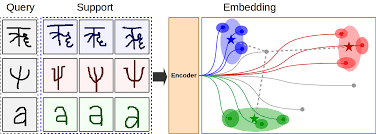
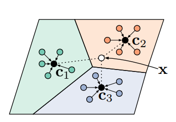

# Prototypical Networks

> Artificial Intelligence is the new electricity - Andrew NG

The change occurred in our life after the expeditious growth in AI and deep learning, in particular, is a solid example of this. The research is booming at unprecedented speed and lives of thousands of people have been improved. If AI is the new electricity then definitely data is the new coal. But recently we’ve seen hazardous depletion in the amount of coal in our environment. This resulted in the development of new technologies which needed a fraction of coal or even no coal at all. Similarly, there are many applications in artificial intelligence where we only have meager data or even no data at all. Hence, we need new techniques to perform well in them. Such problems resulted in the growth of a very popular field, the field of N-shot learning.

To know about it more, go to my blog at [N-Shot Learning: Learning More with Less Data](https://blog.floydhub.com/n-shot-learning/).

To check out how this works, go to my notebook at [kaggle](https://www.kaggle.com/hsankesara/prototypical-net/)

<table>
    <tr>
        <td></td>
        <td></td>
    </tr>
</table>

## Dataset


The network was trained on the [Omniglot dataset](https://github.com/brendenlake/omniglot). The Omniglot data set is designed for developing more human-like learning algorithms. It contains 1623 different handwritten characters from 50 different alphabets.

## How to use the Module

First install all the necessary dependencies

```bash
pip3 install -r requirements.txt
```

- Download the dataset and save it in the directory
- To train, test and save your own model first import the PrototypicalNet module

```python
from prototypicalNet import PrototypicalNet, train_step, test_step, load_weights
```

```python
# Initializing prototypical net
protonet = PrototypicalNet(use_gpu)
```

You can use a pretrained model

```python
# Using Pretrained Model
protonet = load_weights('./protonet.pt', protonet, use_gpu)
```

Or simply train one by yourself

```python
# Set training iterations and display period
    num_episode = 16000
    frame_size = 1000
    trainx = trainx.permute(0, 3, 1, 2)
    testx = testx.permute(0, 3, 1, 2)

    # Initializing prototypical net
    protonet = PrototypicalNet(use_gpu)
    # Training loop
    frame_loss = 0
    frame_acc = 0
    for i in range(num_episode):
        loss, acc = train_step(protonet, trainx, trainy, 5, 60, 5)
        frame_loss += loss.data
        frame_acc += acc.data
        if((i+1) % frame_size == 0):
            print("Frame Number:", ((i+1) // frame_size), 'Frame Loss: ', frame_loss.data.cpu().numpy().tolist() /
                  frame_size, 'Frame Accuracy:', (frame_acc.data.cpu().numpy().tolist() * 100) / frame_size)
            frame_loss = 0
            frame_acc = 0
```

To know more checkout [this](main.py)

Want to use a customized model?

No worries, simply download the code and make suitable changes [here](prototypicalNet.py)

## Project Manager

**[Heet Sankesara](https://github.com/Hsankesara)**

[](https://github.com/Hsankesara/) [](https://www.linkedin.com/in/heet-sankesara-72383a152/) [](https://twitter.com/heetsankesara3) [](https://www.kaggle.com/hsankesara)
